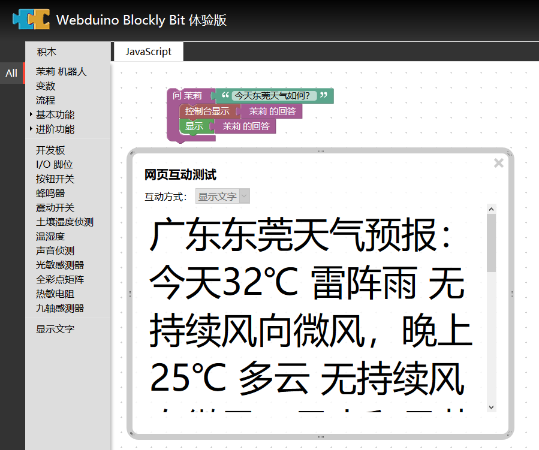

# webduino-blockly-template

This is a webduino block template that implements the API of itpk robot.

这是一个实现茉莉机器人 API 接口的 Blockly 积木模板。

Using classic JavaScript development, you can complete the development of dynamic building blocks.

使用经典的 JavaScript 开发，就可以完成动态积木的开发。

## Help docs

[Usage Webduino Blockly](https://doc.bpi.org.cn/zh_CN/latest/bpi-web/modules/basic.html)

## Address

请先载入插件再继续往下看。

Load the plug-in first, then continue.

`https://bpi.org.cn/webduino-blockly-template/blockly.json`

## Usage

在左下角设置加载这个文件。

load the file ([demos/blockly.xml](demos/blockly.xml))

直接打开这个链接。

open the link [demo](https://bit.webduino.com.cn/blockly/?demo=demo-area-01#qZzEr63j6W)

## Library

在 Blockly Tools 里 import 该文件。

load the file ([demos/library.xml](demos/library.xml))

## About

查阅 API 地址：

[API Docs](http://www.itpk.cn/robot.php)

## Demo

